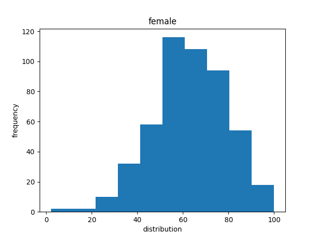
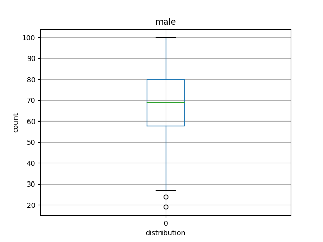

# Математическая статистика

### Задача:

В датасете 1000 наблюдений, для каждого указан пол, баллы по математике, чтению и письменной части.

1. Для результата по математике рассчитать выборочное среднее, медиану и дисперсию. Построить гистограмму и box-plot, асимптотические доверительные интервалы для математического ожидания и дисперсии. То же самое сделать отдельно для каждого пола.

2. Со статистической точки зрения ответить на вопрос: "Зависит ли оценка по математике от пола?"

3. Проверить гипотезу об однородности оценок по разным дисциплинам.

Итоговая визуализация данных с помощью Power BI:

Вывод решения задачи:

  

Графики pyplot:

  
  
